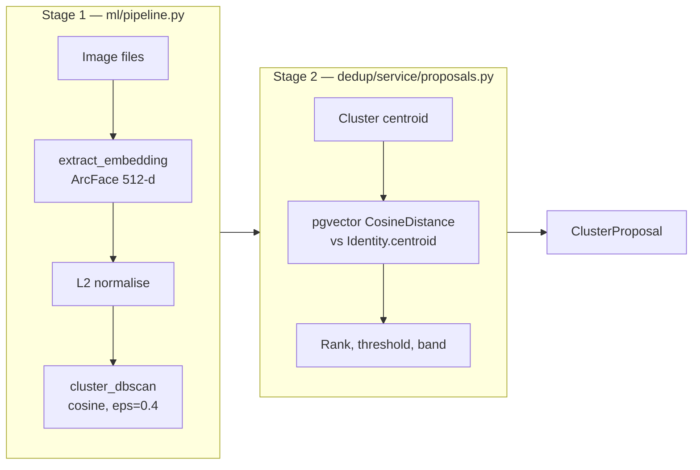
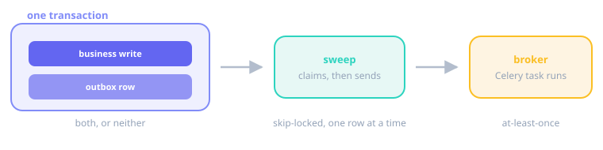

# Architecture

Two applications sit over one ML pipeline. They share no code, and each owns its own
`Identity` and `Image` models.

| App | Shape | Status |
|---|---|---|
| `id_dedup.dedup` | Session-backed, synchronous, request-cycle | Complete; kept as the reference implementation |
| `id_dedup.workflow` | Database-backed, asynchronous, ticketed | In progress; auto-adjudication is a stub |

## The two-stage pipeline

Matching is split in two, and the split is enforced rather than conventional.

**Stage 1 is Django-free.** It takes file paths and returns a `ClusterResult`. No
models, no settings, no ORM.

**Stage 2 is ORM-only.** It queries `Identity.centroid` with pgvector and does no heavy
ML. Lightweight NumPy — stacking vectors to compute a centroid — is fine.

`dedup/service/workflow.py` is the only module that imports both. It is the bridge.

!!! warning "The boundary rule"

    `ml/pipeline.py` has **zero Django imports**, and so does `id_dedup/images.py`.

    This is what lets the ML layer be tested with no database and no Django setup, which
    is most of why the unit test suite is fast. A single `from django...` in
    `pipeline.py` destroys that property, and nothing will fail loudly when you add it.

Stage 2's query is against identity centroids, not against images — one row per known
person rather than one per stored photo — so its cost tracks the number of identities,
not the size of the image table.

## Cluster editing is a pointer move

`ClusterResult.split()` is pure Python. It reassigns members between buckets and
recomputes nothing: no embeddings, no queries. That is why the review step can regroup
instantly.

The rules it follows:

| Situation | Outcome |
|---|---|
| Destination is the source cluster | No-op |
| Destination is an existing cluster | Members move there |
| No destination, one member | Moves to the singletons bucket (`-1`) |
| No destination, two or more members | A new cluster is created |
| Source cluster left empty | It is removed |

New labels are computed **before** any deletion, so labels are never recycled.

## No auto-assignment

Nothing in `pipeline.py`, `service/proposals.py`, `service/workflow.py` or
`dedup/views.py` ever assigns a cluster to an identity on its own. Every assignment in
the wizard originates from an explicit user POST.

This is a hard constraint, not a default. Do not add a code path around it.

The workflow app is different *by design*: automatic adjudication of an image set is
planned in `auto_adjudicate_set`. That task is still a stub and assigns nothing today.

## One write path (wizard)

In the dedup app, exactly one function creates `Identity` and `Image` rows:
`workflow.persist_assignments()`, inside a transaction. It is called from the
adjudication views when the final proposal is resolved.

`complete()` writes nothing — it renders a summary already held in the session. Stage 1
and stage 2 are read-only with respect to the database.

This rule is scoped to the dedup app. The workflow app has its own write paths.

## The durable outbox

The workflow app never publishes to the Celery broker from a request or service path.
Instead the dispatch intent is written **as a database row, in the same transaction as
the business write**, and a sweep publishes it afterwards.

{ .figure }

The property this buys is that a task can never reference a row that was rolled back,
and a committed write can never lose its follow-up task. The two facts commit together
or not at all.

Consequences worth understanding:

- **Delivery is at-least-once.** `dispatched_at` is set *after* a successful send, so a
  crash in between leaves the row pending and it is sent again. Tasks on this outbox
  must tolerate redelivery, and they do — via idempotency guards.
- **Rows are claimed with `SELECT FOR UPDATE SKIP LOCKED`**, one short transaction each.
  Concurrent sweeps never double-claim, and a slow broker never holds a multi-row lock.
- **A failing row is retried at most once per sweep** until `attempts` reaches
  `max_attempts`, then dead-lettered and skipped forever. A broker outage therefore
  burns one attempt per sweep interval rather than exhausting the whole budget in a
  single run.
- **`attempts` counts every attempt**, successes included, so the admin shows real
  history.

Sweeps are scheduled by Celery beat and can also be run by hand with
`./manage.py dispatch_outbox`. See [Reference → Settings](reference/settings.md) for
`OUTBOX_MAX_ATTEMPTS` and `OUTBOX_SWEEP_SECONDS`.

## Conditional UPDATE for state transitions

`ClusterReviewTicket.close()` and `Conversation.close()` both use a conditional
`UPDATE … WHERE <timestamp> IS NULL` rather than assigning a field and calling `save()`.
Two reasons, and both matter:

**Atomicity.** `self.save()` is read-then-write. Two concurrent callers can both read the
open state and both succeed. A conditional UPDATE collapses the check and the write into
one statement, so exactly one caller's `WHERE` clause matches.

**No clobbering.** `save(update_fields=[...])` still writes every field on the instance
that the transaction touched. The conditional UPDATE touches only the timestamp (and
the reviewer), so a concurrent change to `summary` survives.

The return value — did this statement update a row? — is what lets the service layer
tell "I closed it" from "it was already closed", which is what makes retries safe.

## Conventions

- **Model mutations live on the model.** State changes are model methods
  (`Identity.update_centroid()`, `ClusterReviewTicket.close()`), not ad-hoc ORM calls in
  a view or service.
- **Factories are static methods on the model, never QuerySet methods.** Precedent:
  `ClusterReviewTicket.new()`, `Conversation.create_for_cluster_review()`. A QuerySet
  filters; the model constructs.
- **Reusable filters become QuerySet methods** — `ClusterReviewTicket.objects.open()`,
  `Conversation.objects.pending()`.
- **Bulk writes set `updated_at` explicitly.** `auto_now` does not fire for bulk
  operations.
- **No Django Forms, no DRF.** Function-based views by default; class-based only where
  they meaningfully reduce complexity, such as dispatching several verbs.
- **Wizard session keys are always prefixed `wizard_`.**
