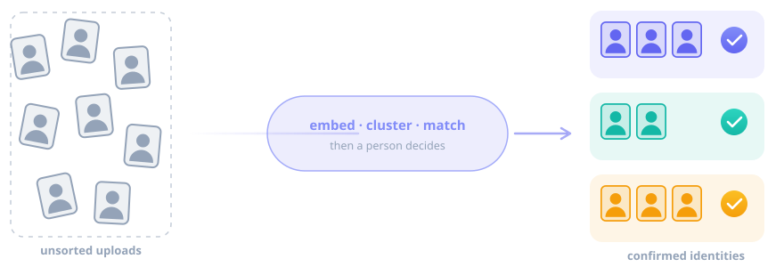
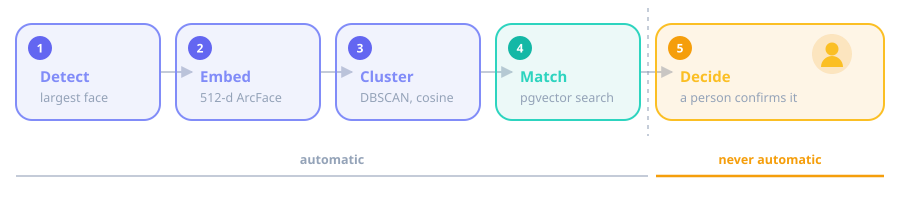
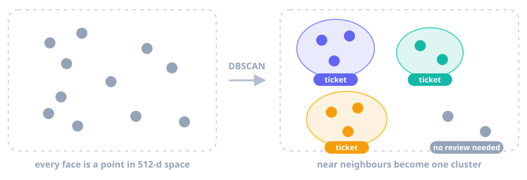
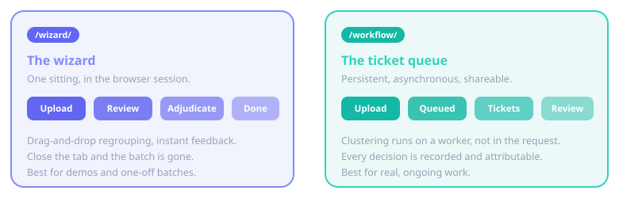

# Know who is who. { .hero-title }

**id-dedup** takes a pile of face photographs and tells you which ones are the same
person — and whether that person is already in your records. It does the hard part
automatically and leaves the last word to you.
{: .hero-lede }

[Get started](dev-guide/setup.md){ .md-button .md-button--primary }
[See how it works](#how-it-works){ .md-button }

{ .hero-art }

## The problem it solves

A collection of identity photographs decays. The same person arrives twice under two
spellings of their name; a re-registration creates a second record; a batch import lands
on top of one that was already there. Nobody notices until the duplicate matters.

Faces do not have spelling variants. id-dedup compares the photographs themselves, so a
duplicate is found even when every field around it disagrees.

-   { .card-icon }

    ### Recognises the face, not the filename

    Every image becomes a 512-dimensional ArcFace vector. Names, dates and reference
    numbers are irrelevant to the match.

-   { .card-icon }

    ### Groups a batch against itself

    Density-based clustering finds the duplicates *inside* an upload before anything is
    compared to your records.

-   { .card-icon }

    ### Searches records at speed

    A pgvector HNSW index searches known identities by similarity — one row per person,
    not one per stored photo.

-   { .card-icon }

    ### Never decides for you

    The machine ranks candidates. A person accepts one. That boundary is enforced in the
    code, not left to configuration.

-   { .card-icon }

    ### Leaves a trail

    Who reviewed what, when, what they kept and what they discarded — recorded as it
    happens, not reconstructed later.

-   { .card-icon }

    ### Loses nothing

    Every asynchronous step commits with the database write that caused it. A crash
    cannot strand a batch half-processed.

## How it works

Five stages. The first four are arithmetic. The fifth is a judgement, and it is always
a person's.

{ .figure }

A face becomes a point in vector space, and two photographs of the same person land
close together. Clustering finds the dense neighbourhoods; anything left alone is a face
that matched nothing and needs no discussion.

{ .figure }

Each group is then reduced to its centroid and compared against the identities you
already hold. What comes back is a ranked shortlist with a similarity score — a
recommendation, not a decision.

!!! quote "The rule that shapes everything else"

    **No image is ever attached to an identity without a person saying so.**

    It is not a setting, a threshold, or a confidence level you can raise. There is no
    code path that assigns an identity on its own, and adding one would be a breaking
    change to the product.

## Two ways to work

-   { .card-icon }

    ### The wizard

    Upload, review, adjudicate, done — in one sitting, in one browser session. Drag
    images between clusters and watch the grouping change instantly.

    Ideal for a demo or a one-off batch.

    [Read the guide →](user-guide/wizard.md)

-   { .card-icon }

    ### The ticket queue

    Uploads are clustered on a worker and become review tickets. Anyone can pick one up,
    and every decision is attributed and kept.

    Ideal for real, ongoing work.

    [Read the guide →](user-guide/tickets.md)

## Built on

| Layer | Technology |
|---|---|
| Backend | Django 5.2, PostgreSQL |
| Vectors | pgvector, 512-d HNSW cosine index |
| ML | InsightFace (ArcFace), scikit-learn, OpenCV |
| Async | Celery + Redis, durable outbox |
| Frontend | HTMX 2, Alpine.js 3, Tailwind CSS v4 |
| Runtime | Python 3.13, managed with uv |

## Start here

-   ### :material-rocket: Run it locally

    Clone, configure, migrate, serve — with the pitfalls called out.

    [Setup →](dev-guide/setup.md)

-   ### :material-book-open: Use it

    Both front ends, step by step, from an operator's point of view.

    [User Guide →](user-guide/wizard.md)

-   ### :material-hammer-wrench: Work on it

    Architecture, the rules that hold it together, testing, and the reference.

    [Development Guide →](dev-guide/index.md)

