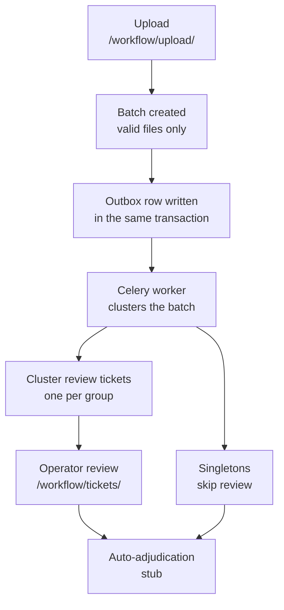
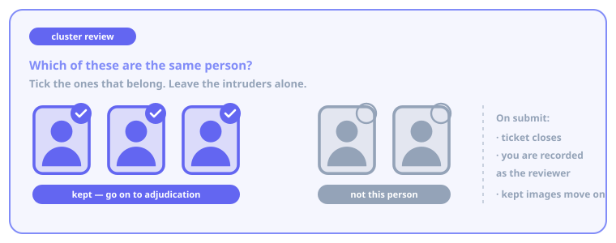

# Review tickets

The `id_dedup.workflow` app is mounted at `/workflow/`. Unlike [the wizard](wizard.md),
its state lives in the database and its clustering runs on Celery, so an upload can be
handed off, picked up later, and reviewed by someone other than the person who made it.

!!! info "In progress"

    Upload → clustering → tickets → review is implemented end to end. The step *after*
    review — automatic adjudication of the images you keep — is a stub: the task is
    dispatched and recorded, but assigns nothing today.

## The lifecycle



## Uploading

`/workflow/upload/` takes a drag-and-drop batch. Files are validated by magic bytes on
the way in, and the response tells you plainly what happened:

- Valid images become rows in a new **batch**.
- Rejected files are **not** silently dropped — their names are recorded on the batch
  and surfaced back to you as a warning.
- If nothing valid remains, no batch is created and you are told so.

The upload request itself does no ML work. It writes the batch and a single outbox row,
then returns.

{ .figure }

!!! warning "Nothing progresses without a worker"

    The request path never talks to the message broker directly. Work is picked up by a
    scheduled sweep of the outbox, so both a Celery worker **and** the beat scheduler
    must be running (`make dev`). If tickets never appear after an upload, that is
    almost always why — `./manage.py dispatch_outbox` drains the backlog by hand.

## What clustering produces

The worker extracts an embedding for every image in which it can find a face, clusters
them, and then, in one transaction:

- stores the embedding for **every** valid image, whether or not it ended up in a group;
- creates one **cluster review ticket** per group of two or more;
- lets **singletons bypass review** entirely and go straight to adjudication.

Only groups need a human. A single unmatched face has nothing to disagree about.

## Reviewing a ticket

{ .figure }

`/workflow/tickets/` lists the queue. Filter with the *open / closed / all* control and
page through it with the pager; open tickets are the default view.

Opening a ticket shows every image the clustering put in that group. The question you
are answering is narrow:

> **Which of these are actually the same person?**

Tick the images that belong; leave the intruders unticked. Submitting the review:

1. **closes the ticket**, recording you as the reviewer and when;
2. writes a **conversation** entry — the audit trail, with the kept and discarded counts;
3. **enqueues the images you kept** for adjudication.

A closed ticket stays visible and readable, with a *closed* badge and a disabled form.
Reviews are not revisable through the UI.

!!! note "Submitting twice is safe"

    Ticket closing is a single conditional database write, so two people submitting the
    same ticket at the same moment cannot both succeed — the second is told the ticket
    is already closed rather than overwriting the first.

## Where the trail lives

Every batch carries a **conversation** — a lifecycle and audit record covering the
upload, the clustering outcome, and each review. Along with the batches, tickets and the
outbox itself, these are all browsable in the Django admin at `/admin/`, which is the
practical place to answer "what happened to this upload?".

## Trying it without real data

```shell
./manage.py seed_tickets    # 20 open tickets with dummy images
```
