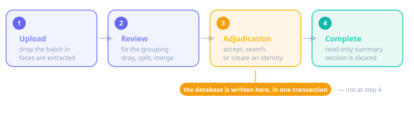

# The wizard

The `id_dedup.dedup` app is a four-step wizard mounted at `/wizard/`. It is
**synchronous and session-backed**: a batch lives entirely in your browser session from
upload until you finish adjudicating it, and nothing is written to the database until
the last cluster has been decided.

It exists as the reference implementation of the manual-adjudication rules and is kept
for demos. For production-shaped work use the [ticket workflow](tickets.md).

## The four steps

{ .figure }

### 1. Upload

Drop in face images — any number, any mix of people. Files are checked by magic bytes,
not by extension; JPEG, PNG and WEBP are accepted and anything else is rejected by name.

Each image is passed through InsightFace to extract a 512-d ArcFace embedding. Images
where no face can be detected are set aside as *failed* and reported back to you rather
than silently dropped. The rest are clustered with DBSCAN using a cosine metric.

!!! note "The first upload is slow"

    InsightFace loads its model on first use and keeps it for the life of the process.
    Expect the first request to take noticeably longer than the ones after it.

### 2. Review

You now see what the machine thinks. Clusters with two or more images are shown as
groups; images DBSCAN could not group are shown as singletons.

{ .figure }

The machine is a starting point, not a verdict, so this step exists to correct it:

- **Drag** an image from one cluster into another.
- **Split** a cluster with the split drawer: select the images that do not belong and
  move them to an existing cluster, or let them form a new one.
- Moving a **single** image out with no destination sends it to the singletons bucket;
  moving **two or more** creates a new cluster.

These are pointer moves. No embedding is recomputed and no query is issued, so
regrouping is instant and free.

When the grouping looks right, save. Each cluster's centroid is computed and matched
against the known identities with a pgvector cosine search, producing a ranked list of
proposals per cluster.

### 3. Adjudication

One cluster at a time, with three ways to resolve it:

| Choice | Result |
|---|---|
| **Accept a proposed match** | The cluster is attached to that existing identity. |
| **Search** | Find any identity by name when the proposals are wrong or empty. |
| **Create a new identity** | Give it a display name; the cluster becomes its first images. |

You can move back and forward through the queue before committing. A cluster whose
similarity search returned nothing above the threshold is flagged as a probable new
identity, but you still have to say so.

!!! warning "Nothing is auto-assigned"

    No code path in the wizard assigns a cluster to an identity by itself. Every
    assignment originates from an explicit action of yours. This is a
    [hard architectural constraint](../dev-guide/architecture.md#no-auto-assignment),
    not a default you can configure away.

When the last cluster is decided, all `Identity` and `Image` rows are written in a
single transaction.

### 4. Complete

A read-only summary of what was persisted, rendered from the session. Reaching this page
writes nothing — the database work already happened at the end of step 3 — and leaving
it clears the session.

## Things worth knowing

- **The session is the batch.** Close the tab mid-batch and the work is gone; there is
  no resumable server-side state. The [ticket workflow](tickets.md) exists precisely to
  fix this.
- **Sign-in is required** for every step.
- **Uploaded files are temporary** until step 3 commits.
- **Similarity thresholds are code defaults**, not settings: `min_similarity=0.6`
  (a match must beat this to be proposed), `top_k=5` (proposals per cluster), and
  `similarity_band=0.1` (proposals more than this far below the best one are dropped).
  Clustering uses `eps=0.4`, `min_samples=2`.
